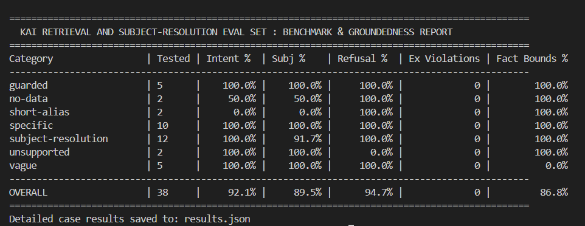

# Kai Evaluation and Regression Harness

A lightweight, deterministic scoring harness for evaluating intent classification, subject resolution, retrieval volume balance, arithmetic groundedness, and safety guardrails in AI workout coaches.

## Overview

Conversational fitness assistants frequently suffer from two common failure modes:

1. Sub-string collision during entity resolution: Preprocessing steps (such as stripping apostrophes from contractions like "how's") can leave stray tokens that trigger wildcard matches on unintended exercises (for example, resolving a general leg question to "Bicycle Crunch Raised Legs").
2. Retrieval volume imbalance: Over-retrieving context on broad questions (causing context bloat) and under-retrieving on specific, time-bounded queries.
3. Ungrounded mathematical claims: Stating volume or e1RM changes that contradict cited log numbers, or promoting a single outlier workout to a long-term trend.

This harness provides a reproducible evaluation pipeline that scores model responses against a synthetic benchmark suite per category rather than relying on a single aggregate number.

## Metrics and Evaluation Engines

### 1. Routing and Retrieval Benchmarks
* Intent Accuracy (%): Exact match against expected query intent classification.
* Subject Resolution Accuracy (%): Exact match across both subject kind (region, exercise, muscle, global, none) and normalized target name.
* Refusal Accuracy (%): Validates that guarded and unsupported queries refuse, and normal queries answer.
* Exercise Constraint Violations: Explicit flag tracking cases that must never resolve to a single exercise.
* Fact Bounds Pass Rate (%): Verifies retrieved workout log facts fall within expected min and max bounds.

### 2. Advanced Groundedness Engines (SC-*, TN-*, ER-*)
* Session Comparison (SC-1 to SC-5): Recomputes directional arithmetic deltas from session data and catches invented numerals in response text.
* Trend vs Noise (TN-1 to TN-5): Enforces sample floors and applies an outlier drop algorithm to verify that directional trends do not invert when the most extreme workout is removed.
* Evidence-Backed Recommendations (ER-1 to ER-5): Verifies that all coaching recommendations reconstruct from cited evidence IDs and comply with safety contracts.

## Quick Start

1. Clone the repository:
git clone https://github.com/roandejager/kai-eval-harness.git
cd kai-eval-harness

2. Run the full benchmark:
py scorer.py

3. Run with custom trend thresholds:
py scorer.py --min-sessions 4 --min-days 21 --export results.json

## Baseline Benchmark Report (v1.2)

## License

MIT License. Free for open-source and commercial evaluation workflows.