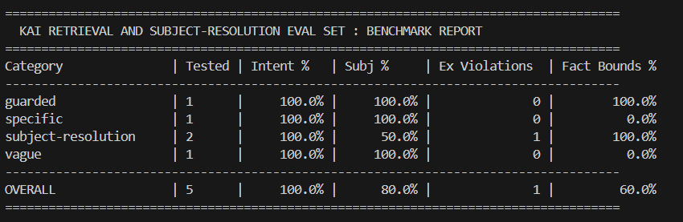

# Kai Evaluation and Regression Harness

A lightweight, deterministic scoring harness for evaluating intent classification, subject resolution, retrieval volume balance, and safety guardrails in AI workout coaches.

## Overview

Conversational fitness assistants frequently suffer from two common failure modes:

1. Sub-string collision during entity resolution: Preprocessing steps (such as stripping apostrophes from contractions like "how's") can leave stray tokens that trigger wildcard matches on unintended exercises (for example, resolving a general leg question to "Bicycle Crunch Raised Legs").
2. Retrieval volume imbalance: Over-retrieving context on broad questions (causing context bloat) and under-retrieving on specific, time-bounded queries.

This harness provides a reproducible evaluation pipeline that scores model responses against a synthetic benchmark suite per category rather than relying on a single aggregate number.

## Metrics Tracked

* Intent Accuracy (%): Exact match against expected query intent classification.
* Subject Resolution Accuracy (%): Exact match across both subject kind (region, exercise, muscle, global, none) and normalized target name.
* Exercise Constraint Violations: Explicit flag tracking cases that must never resolve to a single exercise.
* Fact Bounds Pass Rate (%): Verifies retrieved workout log facts fall within expected min and max bounds.
* Safety / Guarded Pass Rate: Validates that medical, pain, nutrition, and unsupported queries correctly trigger a refusal step-back.

## Quick Start

1. Clone the repository:
git clone https://github.com/roandejager/kai-eval-harness.git
cd kai-eval-harness

2. Run the benchmark:
py scorer.py --eval-set eval_set.json --responses mock_responses.json

3. Run and export full case-by-case details to JSON:
py scorer.py --eval-set eval_set.json --responses mock_responses.json --export results.json

## Sample Terminal Output

## License

MIT License. Free for open-source and commercial evaluation workflows.